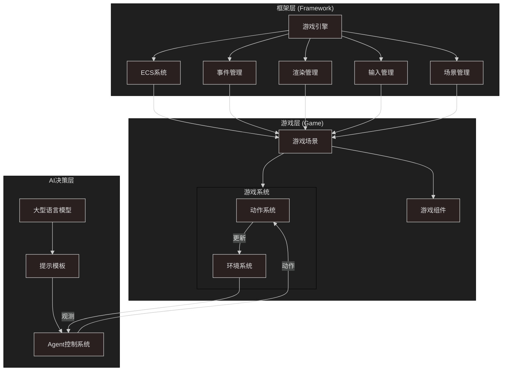
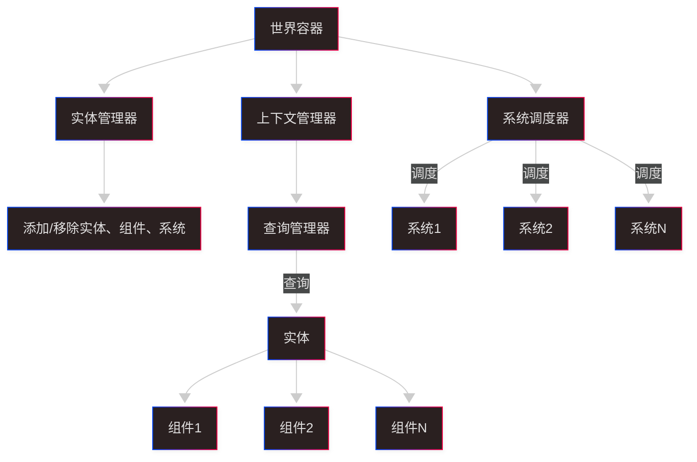
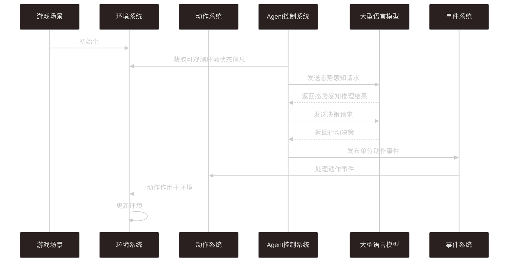

# Romance of the Three Kingdoms

A strategic Tactical Agent Reasoning Benchmark

## Get Started

1. Clone the repository

```bash
git clone https://github.com/yourusername/Romance-of-the-Three-Kingdoms.git
cd Romance-of-the-Three-Kingdoms
```

2. Install the required packages

```bash
uv sync
```

3. Run the game server (must run first, tmux better)

```bash
git clone https://github.com/Lounger-Habitat/GameServer.git
cd GameServer
make dev
```

4. Run the game env

```bash
uv run rotk_env/main.py
```

5. Run the demo agent

```bash
uv run rotk_agent/demo_agent.py
```

## 项目概述

STAR（战略战术代理推理基准）是一个专门用于评估大型语言模型（LLM）的对抗性推理和战略规划能力的基准测试平台。该项目采用模块化架构，系统地管理和评估 LLM 在动态多智能体对抗场景中的推理性能。

## 目录结构

```
/rotk
├── framework/                # 核心框架层，提供ECS架构基础设施
│   ├── ecs/                 # 实体组件系统核心实现
│   │   ├── component.py     # 组件基类定义
│   │   ├── context.py       # ECS上下文，提供系统间通信
│   │   ├── entity.py        # 实体管理
│   │   ├── manager.py       # 实体、组件、系统管理器
│   │   ├── query.py         # 组件查询系统
│   │   ├── system.py        # 系统基类定义
│   │   └── world.py         # 世界容器，管理所有实体和系统
│   ├── engine/              # 游戏引擎核心
│   │   ├── engine.py        # 主引擎循环和初始化
│   │   ├── events.py        # 事件系统
│   │   ├── inputs.py        # 输入处理
│   │   ├── renders.py       # 渲染管理
│   │   └── scenes.py        # 场景管理
│   ├── ui/                  # 用户界面框架
│   └── utils/               # 通用工具
│       └── logging.py       # 日志系统
│
├── game/                    # 游戏实现层，包含具体游戏逻辑
│   ├── assets/              # 游戏资源
│   ├── components/          # 游戏组件定义
│   │   ├── camera/          # 相机相关组件
│   │   ├── map/             # 地图相关组件
│   │   ├── status/          # 状态相关组件
│   │   └── unit/            # 单位相关组件
│   ├── config/              # 游戏配置
│   ├── entities/            # 实体预设
│   ├── managers/            # 游戏管理器
│   ├── scenes/              # 游戏场景
│   ├── systems/             # 游戏系统
│   │   ├── ai/              # AI控制系统
│   │   │   ├── llm_control_system.py  # LLM控制系统
│   │   │   ├── logs/        # LLM日志
│   │   │   └── prompts/     # LLM提示模板
│   │   ├── camera/          # 相机系统
│   │   ├── map/             # 地图系统
│   │   ├── observability/   # 观察系统
│   │   ├── player/          # 玩家控制系统
│   │   ├── ui/              # UI系统
│   │   └── unit/            # 单位系统
│   └── utils/               # 游戏工具
```

## 目录结构解释

### 框架层 (framework/)

框架层提供了游戏开发的基础设施，采用实体组件系统（ECS）架构，实现了高效的游戏对象管理和逻辑分离。

- **ecs/**: 实现了完整的实体组件系统

  - `component.py`: 定义组件基类，所有游戏组件继承自此
  - `entity.py`: 实体管理，实体本身只是一个 ID，不包含数据或逻辑
  - `system.py`: 系统基类，包含游戏逻辑，操作特定组件的实体
  - `world.py`: 世界容器，是 ECS 架构的中心点，协调实体和系统交互
  - `context.py`: 提供系统间共享上下文，便于系统间通信
  - `manager.py`: 提供实体、组件、系统的管理功能
  - `query.py`: 实现高效的组件查询系统

- **engine/**: 游戏引擎核心功能

  - `engine.py`: 游戏主循环和初始化逻辑
  - `events.py`: 事件系统，实现游戏内部通信
  - `inputs.py`: 处理用户输入
  - `renders.py`: 管理游戏渲染
  - `scenes.py`: 场景管理，控制游戏流程

- **utils/**: 通用工具函数和类
  - `logging.py`: 日志系统，记录游戏运行信息

### 游戏层 (game/)

游戏层实现了具体的游戏逻辑，包括单位、地图、战斗等系统。

- **components/**: 游戏组件定义

  - `camera/`: 相机组件，控制游戏视角
  - `map/`: 地图组件，包括地图数据和迷雾战争
  - `status/`: 状态组件，如战场统计组件
  - `unit/`: 单位组件，定义游戏单位属性

- **systems/**: 游戏系统实现

  - `ai/`: AI 控制系统
    - `llm_control_system.py`: LLM 控制系统，使用大型语言模型进行决策
    - `prompts/`: LLM 提示模板，定义与 LLM 交互的格式
  - `unit/`: 单位系统，处理单位移动、攻击等行为
  - `map/`: 地图系统，处理地图渲染和交互
  - `player/`: 玩家控制系统，处理玩家输入
  - `observability/`: 观察系统，收集战场信息

- **scenes/**: 游戏场景
  - `game_scene.py`: 主游戏场景
  - `start_scene.py`: 开始场景
  - `end_scene.py`: 结束场景

## 架构图

### 整体架构



### ECS 架构



### LLM 与游戏引擎交互



## LLM 控制系统

LLM 控制系统是 STAR 基准的核心，它实现了三种不同的 AI 决策模式：

1. **单体决策 (Type 1)**: 一个 LLM 代理控制多个单位，独立作战。每个代理负责自己阵营的所有单位，通过 OODA 循环（观察-定向-决策-行动）进行决策。

2. **群体决策 (Type 2)**: 多个 LLM 代理各自控制一个单位，但需要协作作战。代理之间可以通过共享信息进行协调。

3. **混合决策 (Type 3)**: 一个主控 LLM 代理和多个执行 LLM 代理协同工作。主控代理负责战略规划，执行代理负责战术执行。

LLM 控制系统通过以下步骤与游戏引擎交互：

1. **观察 (Observe)**: 从战场统计组件收集战场信息
2. **定向 (Orient)**: 将战场信息发送给 LLM 进行分析和思考
3. **决策 (Decide)**: 基于思考结果，让 LLM 做出具体行动决策
4. **行动 (Act)**: 将 LLM 的决策转换为游戏事件，如单位移动或攻击

这种设计允许研究人员评估 LLM 在战略规划、战术执行和多智能体协作方面的能力，为 LLM 在复杂对抗性环境中的表现提供了系统化的评估框架。
