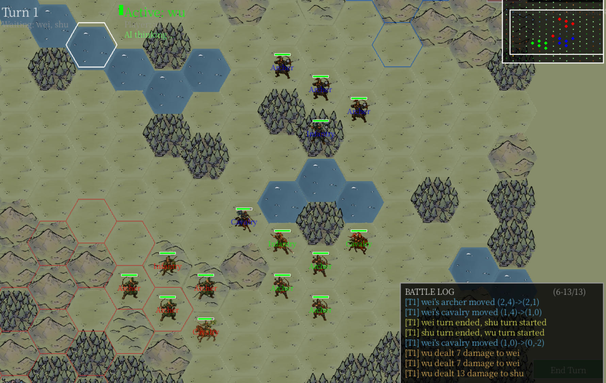
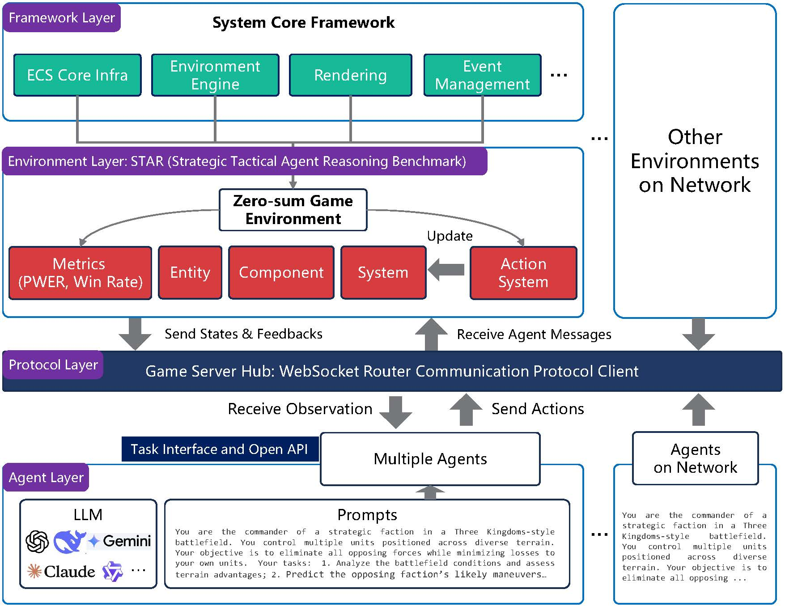

# STAR: Strategic Tactical Agent Reasoning

<div align="center">

[](https://opensource.org/licenses/Apache-2.0)
[](https://www.python.org/)
[]()

[Introduction](#introduction) • [Components](#Components) • [Architecture](#System-Architecture) • [Quick Start](#quick-start)

</div>

---

<div align="center">
  <a href="https://www.youtube.com/watch?v=4bSB5S3ixLI">
    
  </a>
  <br>
  <a href="https://www.youtube.com/watch?v=4bSB5S3ixLI">
    
  </a>
</div>

## 🚀 Introduction

**STAR (Strategic Tactical Agent Reasoning)** is a modular research framework for studying LLM-driven agents in dynamic multi-agent environments.

STAR focuses on evaluating how large language models perform under **long-horizon strategic planning**, **partial observability**, and **real-time decision constraints**, providing a reproducible interface that integrates simulation, evaluation, and extensible agent interaction.

## Overview

<div align="center">
  
</div>

Recent advances in language models have demonstrated strong reasoning ability in static settings, yet their behavior in interactive, dynamic environments remains less understood. STAR provides a standardized environment for investigating decision-making under uncertainty, adversarial interaction, and execution latency.

The framework is designed to decouple simulation logic, agent reasoning, and communication protocols, enabling researchers to build new environments, integrate diverse agent runtimes, and evaluate strategies within a consistent experimental pipeline.

## Components

STAR is organized around three complementary components:

### 🏗️ The Engine (`STAREngine`)
A modular simulation core built on an Entity–Component–System (ECS) architecture.
*   **Data-Oriented:** Data-oriented design for scalable execution.
*   **LLM-friendly modular design:** The decoupling design enables LLMs to intuitively understand and refactor project mechanics without navigating complex inheritance trees.
*   **Extensible:** Researchers can plug in new environments or swap agent backends (DeepSeek, Qwen, GPT-4) without reinventing the wheel.

### 🏆 The Benchmark (`STARBench`)
A benchmarking suite for strategic multi-agent scenarios.
*   **Scenario:** *Romance of the Three Kingdoms (RoTK)* — A zero-sum competitive environment.
*   **Modes:** Configurable real-time and turn-based execution modes.
*   **Metrics:** Standardized evaluation metrics and reporting.

### 🔌 The Protocol (`Star Protocol`)
An asynchronous communication layer for integrating heterogeneous agents and ENVs.
*   **Router Bridge:** Structured message interface between agents and environments
*   **Remote Support:** Runtime-agnostic integration (local or remote)

---

## System Architecture

STAR adopts a hierarchical, modular architecture designed for scalability.



| Layer | Component | Description |
| :--- | :--- | :--- |
| **Agent Layer** | *Decision Host* | Decision hosts implementing perception–planning–action loops. |
| **Protocol Layer** | *Nexus Bridge* | Asynchronous protocol and communication abstraction. |
| **Environment Layer** | *Simulation Logic* | Implements specific ENV rules (e.g., RoTK), physics, and vision systems. |
| **Framework Layer** | *STAREngine* | Core ECS-based execution framework. |

---

## ✨ Key Features

- Strategic multi-agent evaluation
- Real-time and turn-based execution modes
- Partial observability environments
- Extensible environment and agent integration
- Layered ECS runtime for scalable simulation

---

## 📊 Leaderboard

### 🏆 Rating System: Performance-Weighted Elo (PWER)

Unlike traditional benchmarks that rely on static win rates, STAR introduces an outcome-oriented evaluation system based on the **Performance-Weighted Elo Rating (PWER)**. 

Standard Elo Ratings (SER) treat all victories as equal. However, in long-horizon strategic tasks, the *quality* of the victory matters. PWER improves upon this by introducing a **Performance Multiplier ($M$)** calculated from two objective battle statistics:
1.  **Unit Preservation (Resource Efficiency):** The ratio of surviving units to total initial units. This penalizes strategies that sacrifice units recklessly.
2.  **Time Efficiency:** A normalized measure of how quickly the victory was secured. This rewards decisive planning over prolonged stalemates.

<!-- **Robust Estimation via Bootstrap:** To eliminate the sensitivity of Elo ratings to match order, we employ a Monte Carlo bootstrap approach. We perform 1,000 simulations with randomly shuffled match sequences to compute the **mean rating** and **standard deviation**. This ensures the leaderboard is statistically robust and independent of temporal experiment order. -->

*(For detailed mathematical formulations and qualitative analysis like the "Pyrrhic Victory" effect, please refer to our paper).*

### Turn-Based Mode

| Model | PWER | SER | Win Rate |
| :--- | :--- | :--- | :--- |
| Kimi-K2-Thinking | 1206.1 ± 7.3 | 1149.2 ± 3.7 | 1.000 |
| GLM-4.7 | 1182.7 ± 9.5 | 1122.6 ± 5.2 | 0.857 |
| DeepSeek-Chat | 1166.9 ± 16.8 | 1112.3 ± 9.5 | 0.812 |
| GLM-4.6 | 1098.6 ± 14.2 | 1066.4 ± 7.1 | 0.714 |
| MiniMax-M2.1 | 1078.8 ± 16.4 | 1053.9 ± 7.9 | 0.625 |
| Qwen3-32B | 1006.8 ± 12.0 | 1012.8 ± 6.8 | 0.538 |
| Qwen3-30B-A3B-Thinking | 1005.6 ± 11.4 | 998.5 ± 6.2 | 0.500 |
| GPT-OSS-20B | 988.2 ± 12.1 | 988.0 ± 6.2 | 0.462 |
| Qwen3-14B | 972.7 ± 14.9 | 979.1 ± 8.5 | 0.385 |
| Qwen3-8B | 925.1 ± 9.1 | 952.9 ± 4.3 | 0.300 |
| Qwen3-30B-A3B-Instruct | 877.3 ± 11.8 | 913.9 ± 5.2 | 0.231 |
| Nemotron-Nano-9B-v2 | 865.6 ± 9.5 | 910.9 ± 4.1 | 0.182 |
| Kimi-K2-Instruct | 834.9 ± 13.5 | 880.2 ± 6.5 | 0.143 |
| Qwen3-8B-NoThinking | 790.7 ± 8.2 | 859.3 ± 3.9 | 0.077 |

---

<a id="quick-start"></a>
## 🛠️ Quick Start

### Prerequisites
*   Python 3.13
*   `uv` (recommended) or `pip`

```bash
# You can install uv on macOS and Linux.
curl -LsSf https://astral.sh/uv/install.sh | sh

# on Windows.
powershell -ExecutionPolicy ByPass -c "irm https://astral.sh/uv/install.ps1 | iex"

# or with pip.
pip install uv
```

### Installation

```bash
# Clone the repository
git clone https://github.com/star-nexus/star.git
git clone https://github.com/star-nexus/GameServer.git

cd star

# Install dependencies using uv (fastest)
uv sync
```

### Configuration

Before running any agent, you need to specify the API keys for the providers you intend to use. Create a `.configs.toml` file in the project root:

```toml
[deepseek]
model_id = "deepseek-chat"
api_key = "YOUR_API_KEY"
base_url = "https://api.deepseek.com/chat/completions"
```

### Running a Demo (AI v.s. AI)

Experience the *Romance of the Three Kingdoms* scenario directly:

The project supports **three factions** (Wei, Shu, Wu). Each faction can run **multiple agents**, and each agent controls **units** in the env. The commands below start one agent per faction as an example; you can launch more agents per faction with different `--agent-id` values.

First, launch the ENVs/Agents bridge

```bash
cd GameServer
uv run fastapi dev gameserver/main.py
```

Second, launch the RoTK environment.

```bash
cd star
uv run rotk_env/main.py
```

Choose the ENV modes: `Dynamic Real-Time` + `AI v.s. AI Battle`
Click the `Star Game` button.

Next, launch LLM Agents for different factions.

```bash
# Launch an agent for the first faction (Wei).
uv run rotk_agent/qwen3_agent.py \
    --env-id env_1 \
    --agent-id agent_1 \
    --faction "wei" \
    --provider deepseek 

# Launch an agent for the second faction (Shu)
uv run rotk_agent/qwen3_agent.py \
    --env-id env_1 \
    --agent-id agent_2 \
    --faction "shu" \
    --provider deepseek 

# Launch an agent for the third faction (Wu). Requires Three Kingdoms Epic mode.
uv run rotk_agent/qwen3_agent.py \
    --env-id env_1 \
    --agent-id agent_3 \
    --faction "wu" \
    --provider deepseek 
```

### Running Agent Evaluation in Batch

If you want to evaluate agents in batch, you can run the headless evaluation mode:

First, give the competitors in the `provider.txt` like:

```bash
deepseek,glm_47
glm_46,deepseek
```

Then, start the script to launch the evaluation in batch.
```bash
python auto_test.py --mode [real_time | turn_based] --players ai_vs_ai --report-wait 120 --list provider.txt

```

---

## 🗺️ Roadmap

### Core Infrastructure
- [x] ECS-based simulation runtime with scene and entity lifecycle management
- [x] Event-driven execution model and message abstraction
- [x] Deterministic scheduling for reproducible experiments

### Communication Layer
- [x] Bidirectional agent–environment interface via structured message envelopes
- [x] Decoupled hub-based routing between agents and environments
- [x] Support for distributed and remote execution

### STARBench (RoTK Scenario)
- [x] Hex-grid zero-sum strategy environment
- [x] Partial observability (fog-of-war) mechanics
- [x] Turn-based and real-time execution modes
- [x] LLM-driven control interface and standardized observation API

### Agent Framework
- [x] LLM-based decision agents with tool-to-action mapping
- [x] Multi-provider backend support
- [x] Fully decoupled from environment runtime via protocol abstraction

## Citation

If you find this project useful in your research, please consider citing:

```bibtex
@misc{li2026scalingassessingstrategicreasoning,
      title={Beyond Scaling: Assessing Strategic Reasoning and Rapid Decision-Making Capability of LLMs in Zero-sum Environments}, 
      author={Yang Li and Xing Chen and Yutao Liu and Gege Qi and Yanxian BI and Zizhe Wang and Yunjian Zhang and Yao Zhu},
      year={2026},
      eprint={2603.09337},
      archivePrefix={arXiv},
      primaryClass={cs.CV},
      url={https://arxiv.org/abs/2603.09337}, 
}
```

