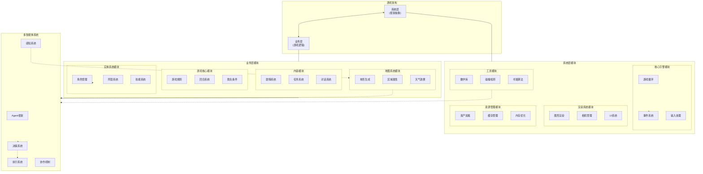

# 三国演义游戏架构设计文档

## 架构概述

游戏架构分为两个核心层次：**系统层**（框架抽象）和**业务层**（游戏逻辑）。这种分层设计确保了底层框架与具体游戏逻辑的分离，提高了代码复用性和可维护性。

## 架构图

## 系统层（框架抽象）

系统层提供了游戏运行所需的底层基础设施和工具，与具体游戏业务逻辑无关，可复用于不同游戏项目。

### 核心引擎模块
- **游戏循环** - 管理更新和渲染周期
- **事件系统** - 提供发布/订阅机制
- **输入处理** - 处理用户输入并转换为游戏事件

### 渲染系统模块
- **图形渲染** - 处理游戏对象的可视化表示
- **相机管理** - 控制游戏视角和可见区域
- **UI系统** - 提供通用UI组件和渲染

### 资源管理模块
- **资产加载** - 加载游戏图像、音频、数据等资源
- **缓存管理** - 优化资源使用和内存占用
- **内存优化** - 管理资源生命周期

### 工具模块
- **数学库** - 提供游戏开发常用数学功能
- **碰撞检测** - 处理游戏对象间的碰撞
- **寻路算法** - 实现A*等路径查找算法

## 业务层（游戏逻辑）

业务层包含与特定游戏相关的逻辑和功能实现，依赖于系统层提供的接口和服务。

### 游戏核心模块
- **游戏规则** - 实现游戏的核心机制和规则
- **回合系统** - 管理串行或并行的回合进行
- **胜负条件** - 定义游戏的结束条件

### 实体系统模块
- **角色管理** - 处理游戏中的角色属性和行为
- **阵营系统** - 管理不同势力的关系和交互
- **技能系统** - 实现角色技能和特殊能力

### 地图系统模块
- **地形生成** - 创建游戏地图和环境
- **区域属性** - 定义不同地形特性（山地、水域等）
- **天气效果** - 实现天气变化对战斗的影响

### 内容模块
- **剧情系统** - 管理游戏剧情和故事线
- **任务系统** - 处理游戏任务和目标
- **对话系统** - 实现角色间对话和交互

## 多智能体系统

在上述架构基础上，多智能体系统作为业务层的一个特殊模块实现：

### 智能体系统模块
- **Agent框架** - 定义智能体的基本结构和行为接口
- **感知系统** - 收集环境信息和其他智能体状态
- **决策系统** - 基于规则或学习算法做出行动决策
- **执行系统** - 将决策转换为具体游戏行动
- **协作机制** - 管理同一阵营智能体间的协同行为

## 设计原则

项目架构设计遵循以下核心原则：

1. **单一职责原则 (SRP)**
   - 每个模块和类只负责一个明确的功能
   - 例如：CollisionManager 只处理碰撞检测，InputManager 只处理输入

2. **开闭原则 (OCP)**
   - 系统设计为易于扩展而无需修改现有代码
   - 例如：通过 EntityFactory 可以轻松添加新实体类型

3. **依赖倒置原则 (DIP)**
   - 高层模块不依赖低层模块，都应该依赖于抽象
   - 例如：游戏场景通过事件系统与组件通信，而非直接调用

4. **接口隔离原则 (ISP)**
   - 不强迫客户端依赖它不使用的方法
   - 例如：BaseController 定义最小接口，子类按需实现

5. **组合优于继承**
   - 通过组件组合构建实体，而非深层继承
   - 例如：Entity-Component 模式的应用

## 分层设计详解

### 核心引擎层 (Engine Layer)

**设计思路**：提供游戏运行的基础设施，定义核心抽象和管理游戏循环。

**核心组件**：
- `GameEngine`: 提供主循环和初始化功能
- `Entity/Component`: 实现实体-组件模式
- `SceneManager`: 管理场景切换
- `EventManager`: 提供事件发布/订阅系统

**设计依据**：
- 采用组件模式而非传统继承体系，增强灵活性和可重用性
- 事件系统用于解耦各模块间的通信，增强系统弹性
- 场景管理支持不同游戏状态间的切换，提供清晰的游戏流程控制

### 管理器层 (Manager Layer)

**设计思路**：提供全局服务和状态管理，处理跨场景的功能。

**核心组件**：
- `GameStateManager`: 管理全局游戏状态
- `CollisionManager`: 处理实体间碰撞
- `MapManager`: 管理地图生成和渲染

**设计依据**：
- 使用单例模式确保全局唯一访问点
- 采用状态模式管理不同游戏状态间的转换
- 通过管理器集中处理复杂或重复的操作，提高代码复用

### 场景层 (Scene Layer)

**设计思路**：实现不同游戏场景，管理场景内实体和逻辑。

**核心组件**：
- `BaseScene`: 场景基类，提供生命周期方法
- `MainMenuScene`, `GameScene` 等特定场景

**设计依据**：
- 提供标准化的场景生命周期，简化场景管理
- 使用模板方法模式统一场景行为
- 场景内数据隔离，减少全局状态依赖

### 控制器层 (Controller Layer)

**设计思路**：在游戏场景内分离不同职责，提高代码组织性。

**核心组件**：
- `BaseController`: 控制器基类
- `PlayerController`, `EnemyController` 等特定控制器

**设计依据**：
- 应用单一职责原则分离不同功能
- 控制器间通过场景或事件系统通信，减少直接依赖
- 统一的生命周期管理简化资源处理

### UI层 (UI Layer)

**设计思路**：提供独立的UI系统，支持复杂界面开发。

**核心组件**：
- `UIManager`: 集中管理UI元素
- `UIElement`, `Panel`, `Button` 等UI组件

**设计依据**：
- 采用组合模式构建UI层次结构
- 事件冒泡机制简化事件处理
- UI与游戏逻辑分离，提高可维护性

### 工厂层与生成器层 (Factory & Generator Layer)

**设计思路**：封装对象创建和内容生成逻辑。

**核心组件**：
- `EntityFactory`: 创建游戏实体
- `MapGenerator`: 生成游戏地图

**设计依据**：
- 工厂模式集中对象创建，提高一致性
- 生成器模式用于复杂对象构建
- 降低代码重复和创建逻辑分散问题

## 设计模式应用

### 组件模式 (Component Pattern)

**应用**：实体-组件系统

**优势**：
- 灵活组合不同功能，避免类爆炸
- 支持运行时动态修改实体行为
- 提高代码复用率

### 观察者模式 (Observer Pattern)

**应用**：事件系统

**优势**：
- 解耦事件发送者和接收者
- 支持多个观察者和动态订阅
- 简化跨模块通信

### 状态模式 (State Pattern)

**应用**：游戏状态管理

**优势**：
- 将状态相关行为封装到单独类中
- 简化状态转换逻辑
- 使状态添加和修改更容易

### 工厂模式 (Factory Pattern)

**应用**：实体创建

**优势**：
- 封装复杂的对象创建过程
- 提供统一的创建接口
- 便于管理对象创建和配置

### 控制器模式 (Controller Pattern)

**应用**：游戏场景管理

**优势**：
- 分离不同职责的业务逻辑
- 提高代码可测试性
- 简化场景复杂度

## 优势与挑战

### 架构优势

1. **高度模块化**
   - 可独立开发和测试各模块
   - 支持多人并行开发

2. **可扩展性**
   - 添加新功能不需大幅修改现有代码
   - 架构支持游戏规模自然增长

3. **可维护性**
   - 清晰的代码组织便于问题定位
   - 降低代码理解门槛

4. **可测试性**
   - 组件和模块解耦便于单元测试
   - 支持模块级别独立测试

### 潜在挑战

1. **学习曲线**
   - 新加入者需要理解架构原则和设计模式
   - 初期开发速度可能稍慢

2. **代码量增加**
   - 接口和抽象增加代码总量
   - 简单功能可能需要更多代码实现

3. **性能开销**
   - 事件系统和组件模式有少量性能开销
   - 需要针对性能瓶颈进行优化

## 未来架构演进

1. **数据驱动扩展**
   - 添加配置系统支持外部数据定义
   - 开发可视化编辑工具

2. **ECS系统完善**
   - 考虑引入更完整的ECS架构
   - 优化组件存储和更新机制

3. **网络功能支持**
   - 预留网络层集成点
   - 设计支持多人游戏的架构扩展

## 总结

本架构设计根据游戏开发的最佳实践和设计原则，打造了一套高内聚、低耦合的模块化系统。通过合理应用设计模式和分层思想，该架构提供了良好的可扩展性、可维护性和团队协作支持，同时保持了适当的灵活性以适应游戏开发过程中的需求变化。

## 游戏概念

### 多智能体对战系统

目前有两个势力，红方和白方，每个势力有四个角色类型，分别是主公、山、水和平。
主公是势力的核心，有且仅有一个，山、水、平是势力的维护者，可以有多个。每个类型都有自己的属性，如擅长水战、擅长山战等。

游戏模式可选择：
- **串行模式**：每个角色都有自己的行动回合，每个回合可以选择移动、攻击、使用技能等。
- **并行模式**：所有角色共享一个时间回合，同时进行行动，每个角色的行动都会影响到其他角色的行动。

游戏目标是消灭对方的主公。
